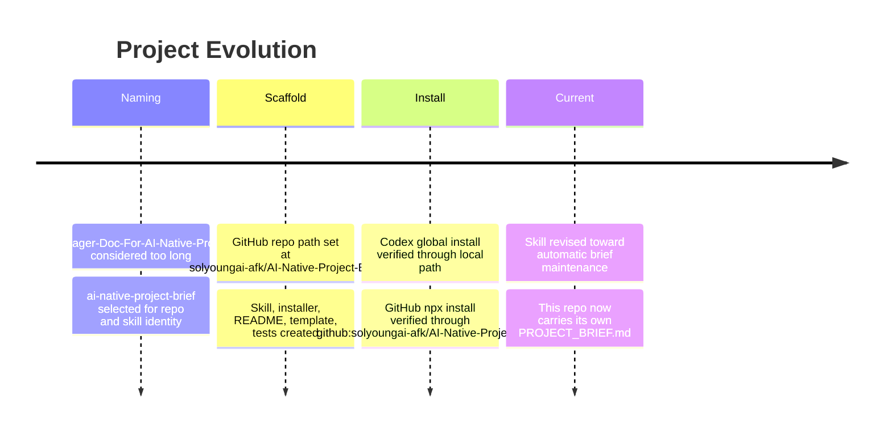
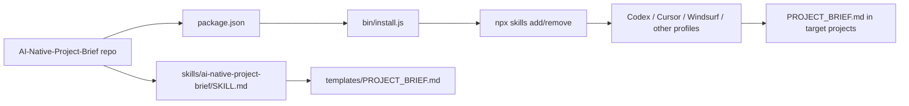
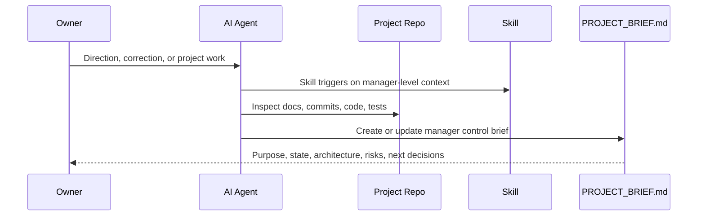

# Project Brief

## Manager Summary

`AI-Native-Project-Brief` is a reusable skill and installer for maintaining manager-facing project control documents in AI-native software projects. Its main output is a root-level `PROJECT_BRIEF.md` that explains project purpose, evolution, current state, architecture, operating model, dependencies, verification, risks, and next human decisions.

The project is now in its initial public repo shape. It has a GitHub-backed installer, a global Codex-compatible skill, a starter brief template, and tests for installer/skill/package structure. The next manager-level decision is whether to broaden installation support beyond `npx skills add` profiles into deeper native integrations for specific agents.

## Why This Exists

- Problem: AI coding agents can inspect code, but human project owners still need a durable control document that captures why the project exists, how it evolved, what works, what is risky, and what decisions remain human-owned.
- Target user or operator: AI-native project managers, solo builders using coding agents, and new AI/human workers entering an existing repo.
- Value: Keeps the human owner oriented without requiring them to read implementation details every time the project changes.
- Non-goals: This is not an API reference generator, low-level code inventory, or replacement for tests and deployment docs.

## Project Evolution

## Current Product State

| Area | State | Evidence | Notes |
|---|---|---|---|
| Skill | Working initial version | `skills/ai-native-project-brief/SKILL.md` | Defines automatic manager-brief maintenance behavior. |
| Template | Working starter | `skills/ai-native-project-brief/templates/PROJECT_BRIEF.md` | Contains required sections and Mermaid diagrams. |
| Installer | Working initial version | `bin/install.js` | Supports `--list`, `--dry-run`, `--only`, `--uninstall`. |
| Codex install | Verified | `npx skills list -g -a codex --json` | Global install path is `C:\Users\wackyky\.agents\skills\ai-native-project-brief`. |
| GitHub install | Verified | `npx.cmd -y github:solyoungai-afk/AI-Native-Project-Brief -- --only codex` | Uses GitHub repo as source. |
| Tests | Passing | `npm test` | 5 tests currently cover package, installer, skill, and template. |

## Current Architecture

Manager-level explanation:

- `bin/install.js` is the cross-agent installer. It delegates skill installation/removal to `npx skills`.
- `skills/ai-native-project-brief/SKILL.md` is the actual behavior contract loaded by compatible agents.
- `templates/PROJECT_BRIEF.md` is copied or used as the starter structure when a target project lacks a manager brief.
- `tests/package.test.mjs` protects the package, installer output, skill body, and template sections from drifting away from the intended behavior.

## Operating Model

- Work starts from the human owner giving project direction or asking for repo work.
- The skill should trigger when manager-level context appears, not only when the owner asks for a brief by name.
- The agent updates `PROJECT_BRIEF.md` when work changes product state, architecture, operating assumptions, dependencies, verification, risk, or human decision points.
- The brief is maintained alongside work so the next worker starts from the current manager context.

## Key Decisions

| Date | Decision | Why It Mattered | Current Impact | Source |
|---|---|---|---|---|
| 2026-05-13 | Use `ai-native-project-brief` as repo/skill identity | Shorter and clearer than `Manager-Doc-For-AI-Native-Project` | Public repo and skill name are concise and install-friendly. | Conversation and repo files |
| 2026-05-13 | Use `PROJECT_BRIEF.md` as target document | Reads as manager-facing control brief without sounding too bureaucratic | Target projects get a predictable root-level file. | Skill and template |
| 2026-05-13 | Keep Superpowers unmodified | Skill must operate independently after or beside Superpowers | No dependency on Superpowers internals. | Skill body |
| 2026-05-13 | Use `npx skills add/remove` delegation | Enables many agent profiles without custom native installers for each | Installer supports Codex and other `skills` profiles. | `bin/install.js` |

## Workstreams

| Workstream | Current State | Owner / Agent Role | Next Step |
|---|---|---|---|
| Skill behavior | Initial behavior defined | Owner sets intent; agent updates `SKILL.md` and tests | Validate in real target projects. |
| Installer | GitHub `npx` path works | Agent maintains provider matrix and flags | Add native integrations only if needed. |
| Documentation | README and this brief exist | Agent keeps manager-facing docs current | Keep README install-focused and brief manager-focused. |
| Tests | Basic structural tests pass | Agent expands tests when behavior changes | Add tests for README wording and automatic behavior. |
| Distribution | GitHub remote pushed | Owner controls repo visibility and release posture | Consider tags/releases after field use. |

## Dependencies And Access

| Dependency | Purpose | Location / Access Pattern | Risk |
|---|---|---|---|
| Node.js >= 18 | Run installer and tests | `node`, `npm`, `npx` | Installer unusable without Node. |
| `skills` CLI | Install skills across compatible agents | Called through `npx -y skills ...` | Behavior may change upstream. |
| GitHub repo | Public distribution source | `github:solyoungai-afk/AI-Native-Project-Brief` | npx install depends on GitHub availability and repo access. |
| Git | Version control and push | `git@github.com:solyoungai-afk/AI-Native-Project-Brief.git` | SSH auth required for push. |
| Compatible agents | Consume the skill | Codex and other `skills` profiles | Each agent may differ in trigger/discovery behavior. |

## Verification And Quality Gates

| Check | Command / Evidence | When To Run | Pass Criteria |
|---|---|---|---|
| Unit tests | `npm test` | Before commit/push | All tests pass. |
| Installer dry-run | `node bin/install.js --dry-run --only codex --no-color` | After installer changes | Prints expected `npx skills add` command with `-g`. |
| Provider list | `node bin/install.js --list --no-color` | After provider matrix changes | Lists supported profiles. |
| Global Codex install | `npx.cmd -y github:solyoungai-afk/AI-Native-Project-Brief -- --only codex --no-color` | After GitHub push when install behavior changes | Installs `ai-native-project-brief` globally. |
| Installed skill list | `npx.cmd -y skills list -g -a codex --json` | After install | Shows `ai-native-project-brief`. |

## Risks And Watchpoints

| Risk | Why It Matters | Watch Signal | Mitigation |
|---|---|---|---|
| Skill behaves like optional command | Owner wants automatic brief maintenance | README or skill says "ask for..." as primary usage | Keep skill wording centered on automatic triggers. |
| Brief becomes code inventory | Manager needs control context, not implementation trivia | Many file/function details, few decisions/risks | Enforce manager-control lens. |
| Installer overclaims support | Profiles may exist but agent-specific behavior may vary | Installs but agent does not trigger skill well | Say "skills CLI profiles" and verify important targets. |
| Superpowers coupling creeps in | Requirement says Superpowers must remain untouched | Skill requires Superpowers files or patches | Keep Superpowers as optional trigger context only. |
| Mermaid overload | One huge diagram becomes unreadable | Diagram mixes history, architecture, and operations | Split diagrams by purpose. |

## Next Human Decisions

These are decisions the AI agent should not silently make alone.

- Should the repo remain a minimal `skills` CLI package, or add deeper native installers for specific agents later?
- Should the brief template stay English-first for public distribution, or include a Korean template variant?
- Should releases/tags be used after the first stable version?
- Which real project should be the first field test for automatic `PROJECT_BRIEF.md` maintenance?

## New Worker Brief

Read this before touching code:

1. This project exists to keep AI-native project managers oriented, not to document every implementation detail.
2. `PROJECT_BRIEF.md` is the product's own control brief and should be updated when manager-level context changes.
3. The skill must remain independent from Superpowers; it can trigger after Superpowers brainstorming but must not patch it.
4. Installer behavior should stay conservative: delegate to `npx skills`, support dry-runs, and verify with tests.
5. Mermaid is required because visual structure is the primary scanning layer for managers and new workers.

## Needs Confirmation

- Whether GitHub repo visibility is public or private.
- Whether users beyond Codex need immediate real-world install verification.
- Whether a Korean localized `PROJECT_BRIEF.ko.md` template should be added.
