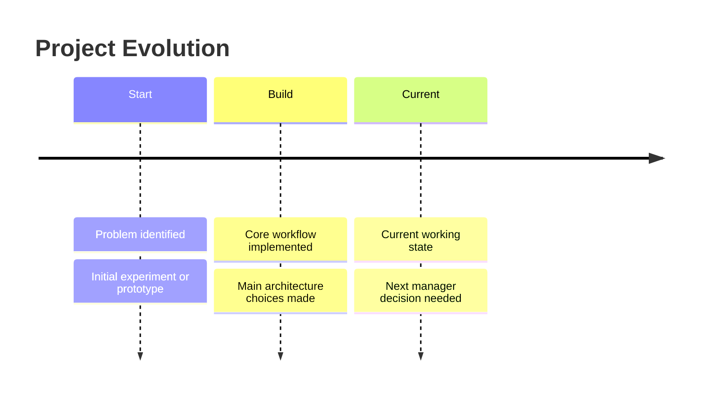
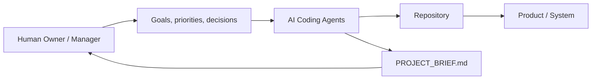
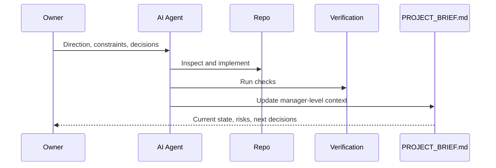

# Project Brief

## Manager Summary

State what this project is, why it matters, current maturity, and the next manager-level decision. Keep this section short enough to read first.

## Why This Exists

- Problem:
- Target user or operator:
- Value:
- Non-goals:

## Project Evolution

This is the project's actual progression so far, not the future todo list.

## Current Product State

| Area | State | Evidence | Notes |
|---|---|---|---|
| Core workflow | Needs confirmation |  |  |
| Demo or runtime | Needs confirmation |  |  |
| Deployment | Needs confirmation |  |  |
| Documentation | Needs confirmation |  |  |

## Current Architecture

Manager-level explanation:

- Main components:
- Data or control flow:
- Runtime/deployment shape:
- Boundaries a new worker must respect:

## Operating Model

- How work starts:
- How decisions are made:
- How verification works:
- How this brief stays current:

## Key Decisions

| Date | Decision | Why It Mattered | Current Impact | Source |
|---|---|---|---|---|
| Needs confirmation |  |  |  |  |

## Workstreams

| Workstream | Current State | Owner / Agent Role | Next Step |
|---|---|---|---|
| Product | Needs confirmation |  |  |
| Architecture | Needs confirmation |  |  |
| Data | Needs confirmation |  |  |
| Automation | Needs confirmation |  |  |
| Deployment | Needs confirmation |  |  |
| Documentation | Needs confirmation |  |  |

## Dependencies And Access

| Dependency | Purpose | Location / Access Pattern | Risk |
|---|---|---|---|
| Needs confirmation |  |  |  |

## Verification And Quality Gates

| Check | Command / Evidence | When To Run | Pass Criteria |
|---|---|---|---|
| Needs confirmation |  |  |  |

## Risks And Watchpoints

| Risk | Why It Matters | Watch Signal | Mitigation |
|---|---|---|---|
| Needs confirmation |  |  |  |

## Next Human Decisions

These are decisions the AI agent should not silently make alone.

- Needs confirmation:

## New Worker Brief

Read this before touching code:

1. 
2. 
3. 

## Needs Confirmation

- 
